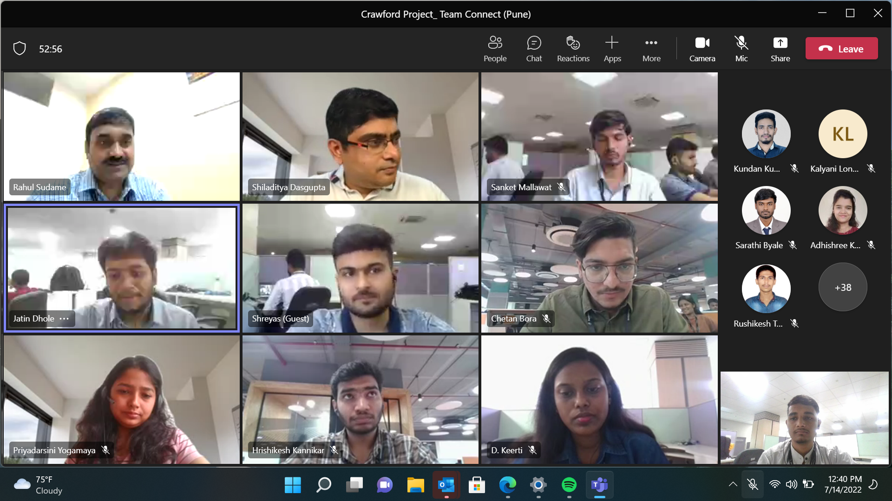

# Claim_Management

Hear I have created a web application with a name Claim management . This application is an outcome of all mentor based training and task.
This application basically handles the claims of the user
Lets start form scratch the flow of the application goes like 
First I created tables for database for that I had used SSMS with just basis tables I started building api and modified database according to need as per api 
 
with name management api then I connected this api whit database by running simple command in database which result in bring all created table to class format in api thus our api is now connected to database after thai I created   4 controllers they are broker ,creates ,insurer and login
These all controller are well capable of performing CURUD operation on the respective parties such as broker ,insurer and user
After creating these controller I had tested the api  on postman .
The login controller which I created was used to for login purpose at a basic level and was not safe for login as the data base table shows password and user details as it was just for basic understanding of login purpose , now which is not of any use , because later on I implemented identity server in mvc ,

After testing api completely on postman  I create new mvc application and called that api in mvc project now my api and mvc project are in same solution explorer

Then similarly I create 4 controllers in mvc which are used for consuming the  information from api using  get and post request to api which result in sending the the data filled by user to api and then api to database as our database is connected to api not with mvc ,perform various task on mvc like creating dropdown list creating various form ,redirection of forms ,routing and bringing various information on dash bord and many more these  all task are listed in exel sheet which me and my mentor had maintained during training sessions . Then comes designing part which is done through the views of mvc .

And for login purpose implemented identity server.
<!--  -->

